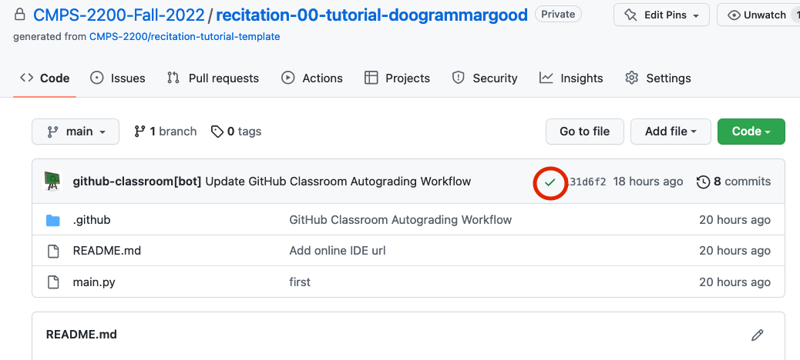

# Recitation Workflow Tutorial

This lab is a tutorial to get you initiated in the workflow we will be using to complete recitations and assignments using GitHub Classrooms this semester. As an overview, for each recitation/assignment, you will accept it through a link provided on Canvas. You must already have done that to be here. Then you will clone the repository to your computer to complete the assignment locally. When you are finished, you will push your final version up to GitHub and submit a link to your repository to the canvas assignment.

1. [Clone] this lab to your computer.
    - When you clone, you are downloading the files of the repository to your computer. In order to clone, you need to copy a clone link which you can find under the green "Code" button on your repositories main page. You should copy either the `https` link or the `ssh` link. 
      - If you use the `https` link, you will be prompted from your github username and password whenever you clone, pull, or push to github. 
      - If you use the `ssh` link, you will not have to enter your username and password to communicate with github. Authentication will happen automatically through ssh. However, in order to use ssh authentication, you need to generate and add an ssh key to your github account. This is a quality of life improvement that is well worth it. 
        - [Generating a new ssh key]
        - [Adding a new ssh key to github]
    - One you have the link copied, on your computer in a terminal  issue the command:
  
      `$ git clone your_clone_link`
  
      The files will be downloaded and placed in a directory in your present working directory. 
2. Implement the `sum_of_squares` function in `main.py`, and confirm that the provided test function `test_one` passes on your computer.
    - You can run the tests locally using `pytest`. To install `pytest`, on your terminal:
      + `$ pip3 install pytest`
    - It's usually best to run only one test at a time. To run tests, from the command-line:
      + `$ pytest main.py` will run all tests in main.py
      + `$ pytest main.py::test_one` will just run `test_one`
    - This is exactly how GitHub will test your code.
    - If you want to run your whole program, make sure to use `python3`. `python` might still default to python version 2.
3. `Add`, `commit`, and `push` your completed lab back up to GitHub. 
    - You will need to issue `git add` for all files that you have modified. For this test lab, that should only be `main.py`, but for regular labs, they can also include an `answers.md` for written answers (and possibly other files as well).
    - Here are the commands for adding, commiting, and pushing main.py to GitHub. In the same directory as your cloned lab:
      ```
      $ git add main.py
      $ git commit -m "Implement Sum of Squares"
      $ git push origin main
      ```
      For the `commit` command, if you *do not* pass the commit message using the `-m` flag, you will be dropped into vim where git will expect to input a commit message to the top of that file. To do this, hit the `i` key to go into `--INSERT--` mode, type your commit message, hit `ESC` to leave insert mode, and type `:wq` to write and quit vim.

      You can `add`, `commit`, and `push` as often as you like. This is recommended. You are essentially saving your work to github as your complete it. By doing so, you guard against losing work if you have any problems with your computer. You can also revisit any previous state that you have commited at any time. When we grade your recitations and assignments, we will always grade the latest version pushed to GitHub.
4. Verify that the tests have passed on github and that you have received your points. On your github repository's home page, you will see a green check mark if all tests have passed:

If any of your tests are not passing you will see an "X'. You can click on the checkmark or the X for more details.

5. Finally, go to the canvas assignment for this recitation and submit a link to this repository so that we can grade your work and you get your hard-earned points!

    Once you've done this, you are done! You are now have the tools and workflow to complete all recitations and assignments this semester.

[clone]: https://docs.github.com/en/github/creating-cloning-and-archiving-repositories/cloning-a-repository-from-github/cloning-a-repository
[Generating a new ssh key]: https://docs.github.com/en/authentication/connecting-to-github-with-ssh/generating-a-new-ssh-key-and-adding-it-to-the-ssh-agent
[Adding a new ssh key to github]: https://docs.github.com/en/authentication/connecting-to-github-with-ssh/adding-a-new-ssh-key-to-your-github-account